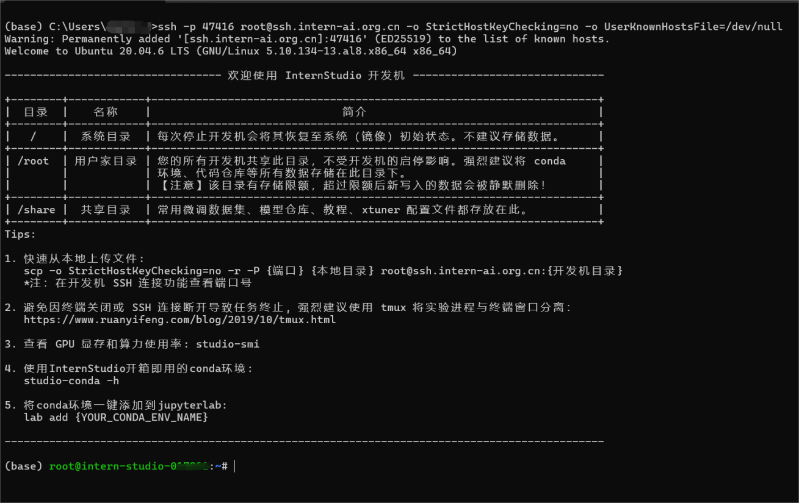
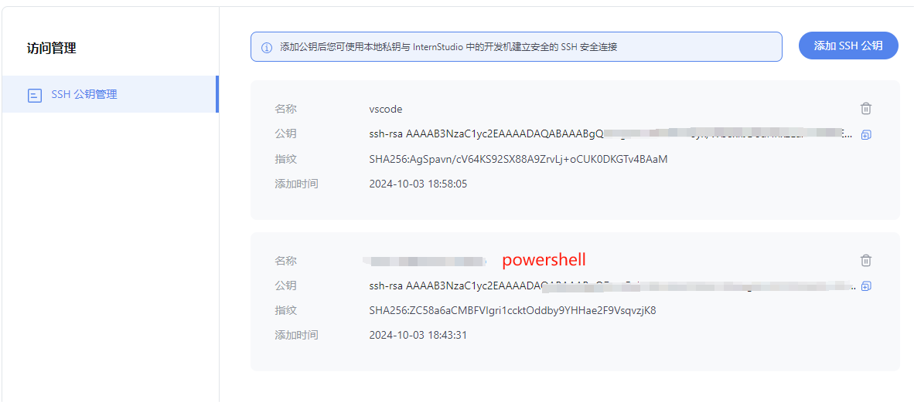
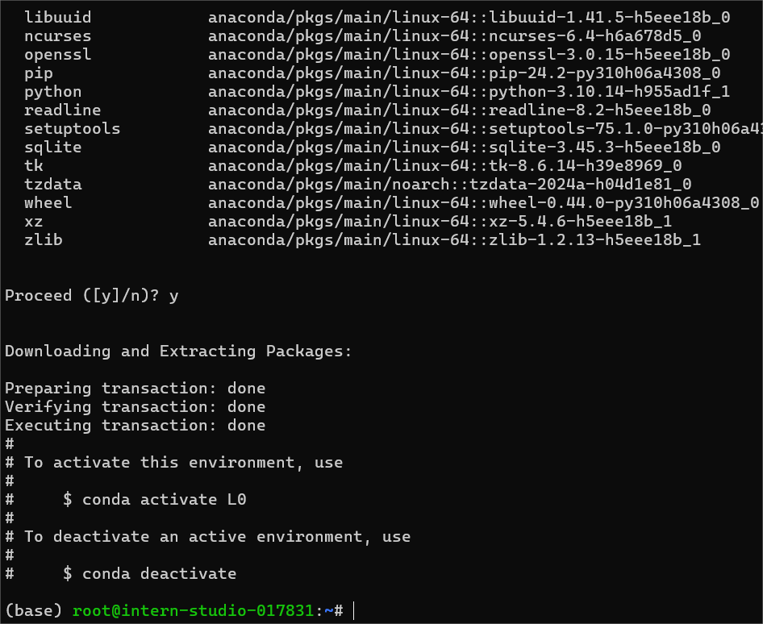

 # 0 Introduction
需要用到的几个链接：
- [InternStudio开发平台](https://studio.intern-ai.org.cn/console/dashboard)
- [L0.1_Linux文档教程](https://github.com/InternLM/Tutorial/blob/camp3/docs/L0/Linux/readme.md)
- [L0.1_Linux视频教程](https://www.bilibili.com/video/BV1FS421d7yg/)

任务：
| 完成情况 | 任务类型       | 任务内容 | 预计耗时 |
| :-: | :-: |:-:| :-:|
| ✓  | 闯关任务   | 完成SSH连接与端口映射并运行`hello_world.py`   | 10min        |
| ✓ | 可选任务 1 | 将Linux基础命令在开发机上完成一遍             | 10min        |
| ✓ | 可选任务 2 | 使用 VSCODE 远程连接开发机并创建一个conda环境 | 10min        |
| ✓ | 可选任务 3 | 创建并运行`test.sh`文件                       | 10min        |

 # 1 Main Task
> 完成SSH连接与端口映射并运行`hello_world.py`
## 1.1 使用密码进行SSH远程连接

用VScode 和 powershell都成功连接。



## 1.2 配置密钥，免密远程连接

用powershell连接，成功。

用VScode连接，失败。是因为两个工具生成的rsa密钥不同，得在vscode终端中再生成一个，添加在开发机平台中，就可以用vscode免密远程连接开发机了。




## 1.3 运行`hello_word.py`，端口映射。

设置国内镜像提升安装速度
```
#设置清华镜像
conda config --add channels https://mirrors.tuna.tsinghua.edu.cn/anaconda/pkgs/main
conda config --add channels https://mirrors.tuna.tsinghua.edu.cn/anaconda/pkgs/free
conda config --add channels https://mirrors.tuna.tsinghua.edu.cn/anaconda/pkgs/r
conda config --add channels https://mirrors.tuna.tsinghua.edu.cn/anaconda/pkgs/pro
conda config --add channels https://mirrors.tuna.tsinghua.edu.cn/anaconda/pkgs/msys2
```

使用`conda create -n L0 python=3.10`创建名为L0的虚拟环境



使用`conda activate L0`命令来激活虚拟环境


使用`touch hello_world.py`命令来创建一个`hello_world.py`文件

用vim编辑器将代码粘贴进文件中，`:wq`保存并退出。


使用`pip install gradio==4.29.0`命令安装依赖包，然后在Web IDE的终端中运行`hello_world.py`


使用PowerShell输入以下命令
```
ssh -p 47416 root@ssh.intern-ai.org.cn -CNg -L 7860:127.0.0.1:7860 -o StrictHostKeyChecking=no
```

