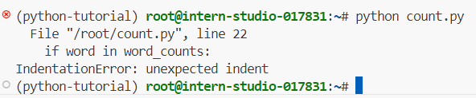
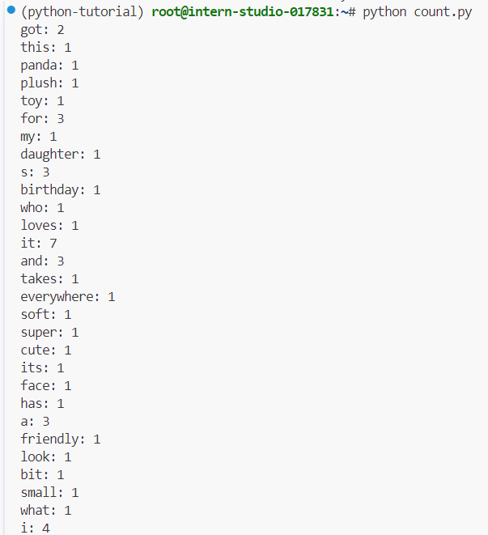
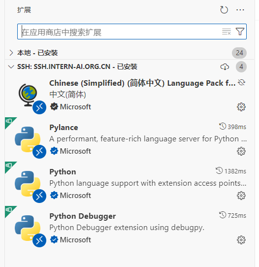
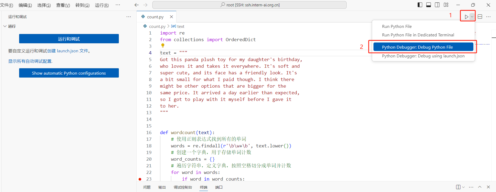
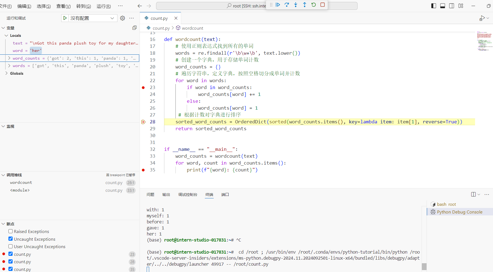
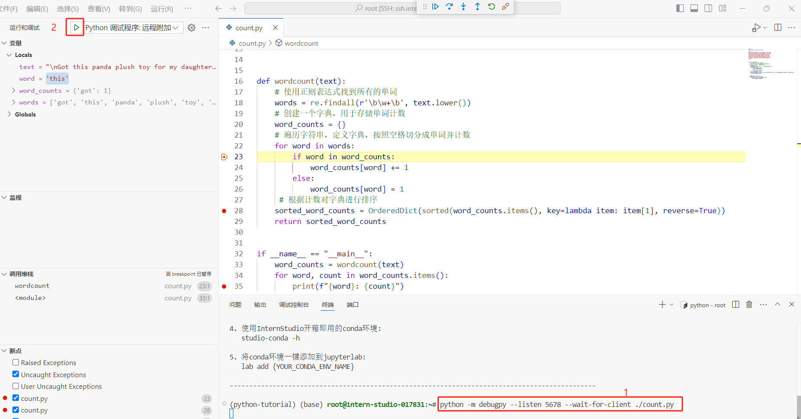

 # 0 Introduction
需要用到的几个链接：
- [InternStudio开发平台](https://studio.intern-ai.org.cn/console/dashboard)
- [L0.2_Python文档教程](https://github.com/InternLM/Tutorial/blob/camp3/docs/L0/Python/task.md)
- [L0.2_Python视频教程](https://www.bilibili.com/video/BV1mS421X7h4/)

任务：
| 完成情况 | 任务类型 | 任务内容 | 预计耗时 |
| :-: | :-: |:-:| :-:|
| ✓ |闯关任务|Python实现wordcount| 15mins|
|✓|闯关任务| Vscode连接InternStudio debug笔记 |15mins|

 # 1 Task 1
> Python实现wordcount

## 1.1 方法

**方法1**：定义一个新的字典word_counts进行计数。

```python
import re


text = """
Got this panda plush toy for my daughter's birthday,
who loves it and takes it everywhere. It's soft and
super cute, and its face has a friendly look. It's
a bit small for what I paid though. I think there
might be other options that are bigger for the
same price. It arrived a day earlier than expected,
so I got to play with it myself before I gave it
to her.
"""


def wordcount(text):
    # 使用正则表达式找到所有的单词
    words = re.findall(r'\b\w+\b', text.lower())
    # 创建一个字典，用于存储单词计数
    word_counts = {}
    # 遍历字符串，定义字典，按照空格切分成单词并计数
    for word in words:
        if word in word_counts:
            word_counts[word] += 1
        else:
            word_counts[word] = 1
    return word_counts


if __name__ == "__main__":
    word_counts = wordcount(text)
    for word, count in word_counts.items():
        print(f"{word}: {count}")
    
```

注释：

- `r` 表示这是一个原始字符串，意味着字符串中的反斜杠 `\` 不会被当作转义字符。
- `\b`：表示单词边界，确保单词的前后面不是字母，这样就只匹配完整的单词。
- `\w` 匹配 `[a-zA-Z0-9_]`，匹配任何字母、数字以及下划线。
- `+` 与 `\w` 结合使用，表示匹配一个或多个连续的单字字符。
- `text.lower()` 将文本转换为小写，这样单词的计数就不会区分大小写了。


**方法2：**用封装好的函数Counter（）来实现。

``````python
import re


text = """
Got this panda plush toy for my daughter's birthday,
who loves it and takes it everywhere. It's soft and
super cute, and its face has a friendly look. It's
a bit small for what I paid though. I think there
might be other options that are bigger for the
same price. It arrived a day earlier than expected,
so I got to play with it myself before I gave it
to her.
"""


def word_count(text):
    # 使用正则表达式找到所有的单词，并转换为小写
    words = re.findall(r'\b\w+\b', text.lower())
    # 使用Counter计算每个单词出现的次数
    return Counter(words)


if __name__ == "__main__":
    word_counts = wordcount(text)
    for word, count in word_counts.items():
        print(f"{word}: {count}")
``````

## 1.2 实现

### 1.2.1 连接开发机，创建环境

用本地VScode连接InterStudio开发机(上一节已经连接过了)，开发机已经有conda环境。

```bash
# 创建一个虚拟环境名为python-tutorial，python版本为3.10
conda conda create -n python-tutorial python=3.10
# 激活该环境
conda activate python-tutorial
# 下载练习python需要的jupyter lab
pip install jupyter lab
# 下载需要练习的numpy包
pip install numpy

```

### 1.2.2 创建文件，运行代码

```bash
# 创建单词计数的python文件
touch count.py
# 打开vim编辑器，i进入编辑模式，复制粘贴方法一的代码，Esc退出编辑模式，:wq保存并退出。
vim count.py
# 运行代码
python count.py
```

发现代码中缩进有问题



修改后重试，得到统计的结果的字典格式。



可以对当前代码进行改进，根据计数从高到低排列。

```bash
import re
from collections import OrderedDict

text = """
Got this panda plush toy for my daughter's birthday,
who loves it and takes it everywhere. It's soft and
super cute, and its face has a friendly look. It's
a bit small for what I paid though. I think there
might be other options that are bigger for the
same price. It arrived a day earlier than expected,
so I got to play with it myself before I gave it
to her.
"""


def wordcount(text):
    # 使用正则表达式找到所有的单词
    words = re.findall(r'\b\w+\b', text.lower())
    # 创建一个字典，用于存储单词计数
    word_counts = {}
    # 遍历字符串，定义字典，按照空格切分成单词并计数
    for word in words:
        if word in word_counts:
            word_counts[word] += 1
        else:
            word_counts[word] = 1
     # 根据计数对字典进行排序
     sorted_word_counts = OrderedDict(sorted(word_counts.items(), key=lambda item: item[1], reverse=True))
     return sorted_word_counts


if __name__ == "__main__":
    word_counts = wordcount(text)
    for word, count in word_counts.items():
        print(f"{word}: {count}")
    
```


# 2 Task 2

> Vscode连接InternStudio debug笔记

## 2.1 Debug单个python文件

连接远程开发机后，安装以下python插件。



点击debug单个文件



查看当前步骤变量



## 2.2 在vscode使用命令行进行debug

```bash
pip install debugpy
python -m debugpy --listen 5678 --wait-for-client ./count.py
```

