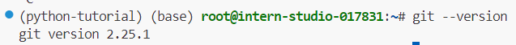
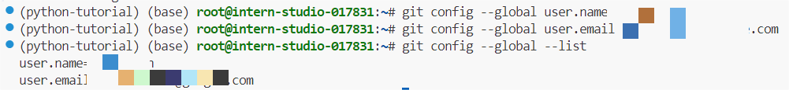
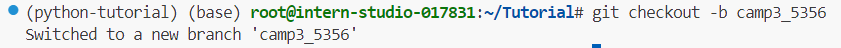
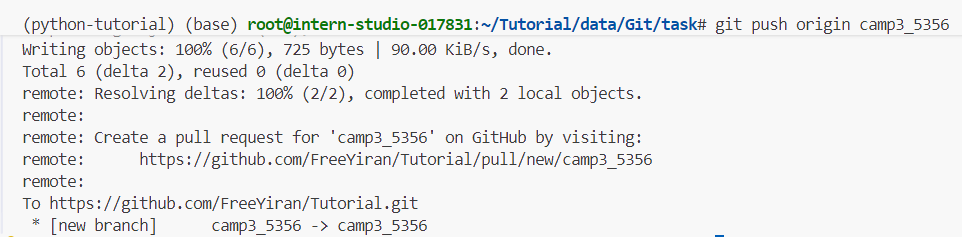
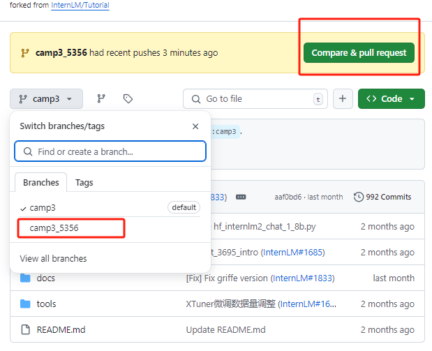
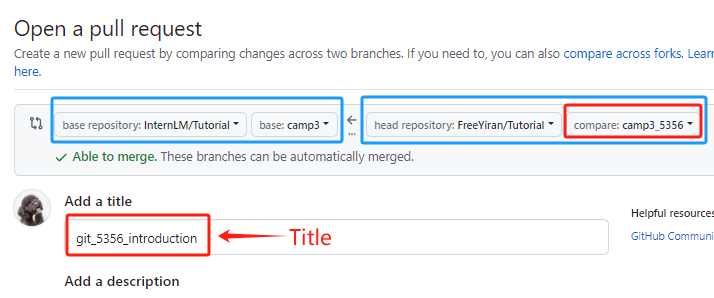
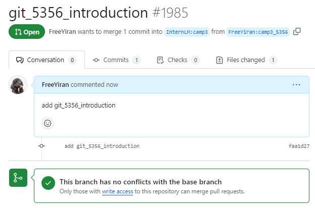
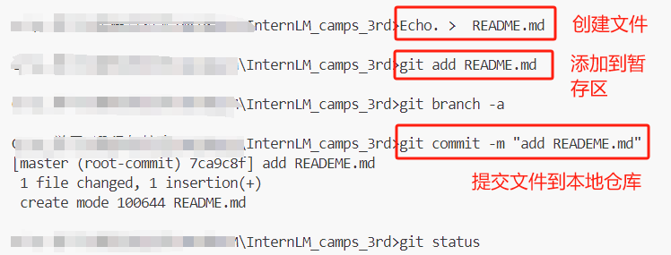
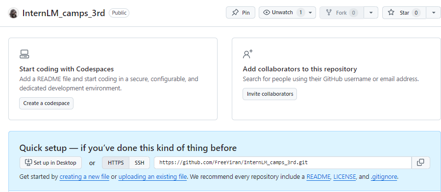
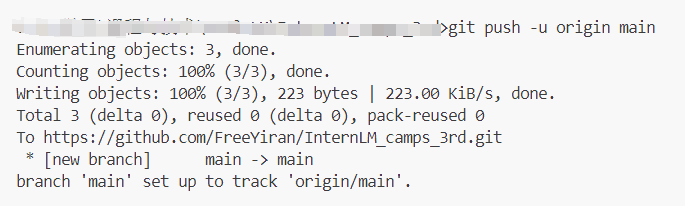

 # 0 Introduction
需要用到的几个链接：
- [InternStudio开发平台](https://studio.intern-ai.org.cn/console/dashboard)
- [L0.3_Python文档教程](https://github.com/InternLM/Tutorial/blob/camp3/docs/L0/Python/task.md)
- [L0.3_Python视频教程](https://www.bilibili.com/video/BV1mS421X7h4/)

任务：
| 完成情况 | 任务名称 | 任务内容 |
| :-: | :-: |:-:|
| ✓ |破冰活动|   [自我介绍](https://github.com/InternLM/Tutorial/pull/1985/files)   |
|✓|实践项目| [构建个人项目](https://github.com/FreeYiran/InternLM_camps_3rd) |

 # Task1 自我介绍
> 每位参与者提交一份自我介绍。 提交地址：https://github.com/InternLM/Tutorial 的 camp3 分支～
>
> 要求：
>
> 1. 命名格式为 `camp3_<id>.md`，其中 `<id>` 是您的报名问卷ID。
> 2. 文件路径应为 `./data/Git/task/`。
> 3. 【大家可以叫我】内容可以是 GitHub 昵称、微信昵称或其他网名。
> 4. 在 GitHub 上创建一个 Pull Request，提供对应的 PR 链接。

## 1.1 环境配置

### 1.2.1 连接开发机，下载Git

用本地VScode连接InterStudio开发机，激活上一节创建的环境`python-tutorial`。

```bash
# 激活该环境
conda activate python-tutorial
# 输入指令检查安装版本
git --version
```



### 1.2.2 设置全局用户信息

```bash
# 设置全局用户名
git config --global user.name "Your Name"
# 设置全局电子邮件地址
git config --global user.email "your.email@example.com"
```



### 1.2.3 验证设置

```bash
# 查看全局配置
git config --global --list
# 查看特定配置项
git config user.name
git config user.email
```

## 1.2 Git开发流程

- Fork [目标项目链接](https://github.com/InternLM/Tutorial) ，选择只复制camp3分支。

```bash
git clone https://github.com/FreeYiran/Tutorial.git # 修改为自己fork的仓库
cd Tutorial/
# 查看所有分支，发现只有camp3分支
git branch -a
```


- 自定义一个新的分支，最后的XXXX替换为个人问卷ID

```bash
git checkout -b camp3_XXXX
```



- 创建自我介绍文件到指定路径

```bash
touch ./data/Git/task/camp3_XXXX.md # 修改为自己的问卷ID
```

- 提交更改到分支

```bash
# 添加到暂存区
git add .
# 将暂存区中的更改提交到本地仓库，附带信息记录
git commit -m "add git_XXXX_introduction"
# 推送到远程仓库
git push origin camp3_XXXX
```



- 查看提交



- 在 Github 页面将修改的内容 Pull Request 到 Tutorial，修改Title



提交成功



[Pull Request 链接](https://github.com/InternLM/Tutorial/pull/1985/files)

# Task 2 创建个人项目

> 创建个人仓库，用于提交笔记、心得体会或分享项目。

## 2.1 初始化

```bash
# 创建本地仓库
mkdir InternLM_camps_3rd
cd InternLM_camps_3rd
# 初始化仓库
git init
# 查看状态
git status
```

## 2.2 创、添、提文件 



## 2.3 远程仓库操作

### 2.3.1 在Github网页创建一个仓库



### 2.3.2 关联一个远程仓库

```bash
git remote add origin https://github.com/FreeYiran/InternLM_camps_3rd.git
```

### 2.3.3 提交到远程仓库

远程分支默认是main，master是本地整个项目的主分支，将当前的本地分支重命名为 `main`

````
git branch -M main
````

将本地的 `main` 分支推送到远程仓库 `origin`，并设置为默认的上游分支

```bash
git push -u origin main
```



[Github仓库构建个人项目链接](https://github.com/FreeYiran/InternLM_camps_3rd)

