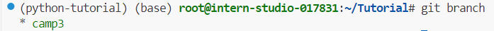

 # 0 Introduction
需要用到的几个链接：
- [InternStudio开发平台](https://studio.intern-ai.org.cn/console/dashboard)
- [L0.3_Python文档教程](https://github.com/InternLM/Tutorial/blob/camp3/docs/L0/Python/task.md)
- [L0.3_Python视频教程](https://www.bilibili.com/video/BV1mS421X7h4/)

任务：
| 完成情况 | 任务名称 | 任务内容 |
| :-: | :-: |:-:|
| ✓ |破冰活动|   自我介绍   |
|✓|实践项目| 构建个人项目 |

 # Task1 自我介绍
> 每位参与者提交一份自我介绍。 提交地址：https://github.com/InternLM/Tutorial 的 camp3 分支～
>
> 要求：
>
> 1. 命名格式为 `camp3_<id>.md`，其中 `<id>` 是您的报名问卷ID。
> 2. 文件路径应为 `./data/Git/task/`。
> 3. 【大家可以叫我】内容可以是 GitHub 昵称、微信昵称或其他网名。
> 4. 在 GitHub 上创建一个 Pull Request，提供对应的 PR 链接。

## 1.1 环境配置

### 1.2.1 连接开发机，下载Git

用本地VScode连接InterStudio开发机，激活上一节创建的环境`python-tutorial`。

```bash
# 激活该环境
conda activate python-tutorial
# 输入指令检查安装版本
git --version
```


### 1.2.2 设置全局用户信息

```bash
# 设置全局用户名
git config --global user.name "Your Name"
# 设置全局电子邮件地址
git config --global user.email "your.email@example.com"
```


### 1.2.3 验证设置

```bash
# 查看全局配置
git config --global --list
# 查看特定配置项
git config user.name
git config user.email
```

## 1.2 Git开发流程

Fork [目标项目链接](https://github.com/InternLM/Tutorial) ，选择只复制camp3分支。

```bash
git clone https://github.com/FreeYiran/Tutorial.git # 修改为自己fork的仓库
cd Tutorial/
# 查看所有分支，发现只有camp3分支
git branch -a
```



自定义一个新的分支，最后的XXXX替换为个人问卷ID

```bash
git checkout -b camp3_XXXX
```


创建自我介绍文件到指定路径

```bash
touch ./data/Git/task/camp3_XXXX.md # 修改为自己的问卷ID
```

提交更改到分支

```bash
# 添加到暂存区
git add .
# 提交信息记录
git commit -m "add git_5356_introduction"
```


# Task 2 创建个人项目

> Vscode连接InternStudio debug笔记

## 2.1 Debug单个python文件

连接远程开发机后，安装以下python插件。


点击debug单个文件


查看当前步骤变量


## 2.2 在vscode使用命令行进行debug

```bash
pip install debugpy
python -m debugpy --listen 5678 --wait-for-client ./count.py
```

