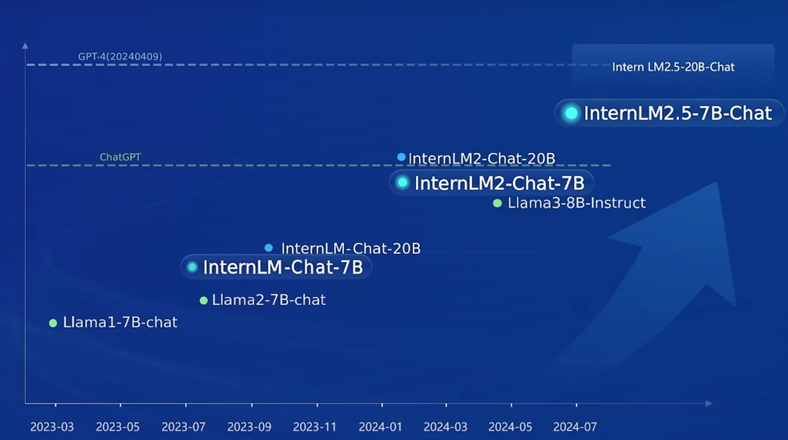
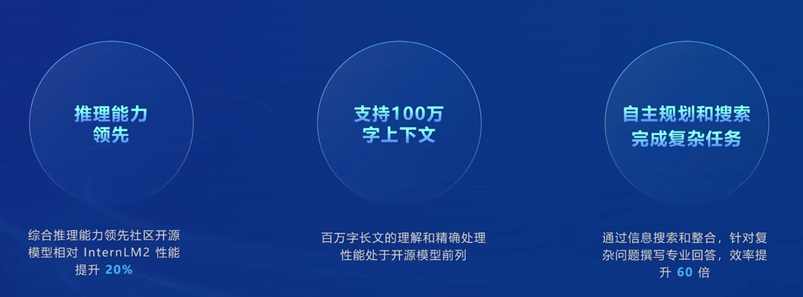
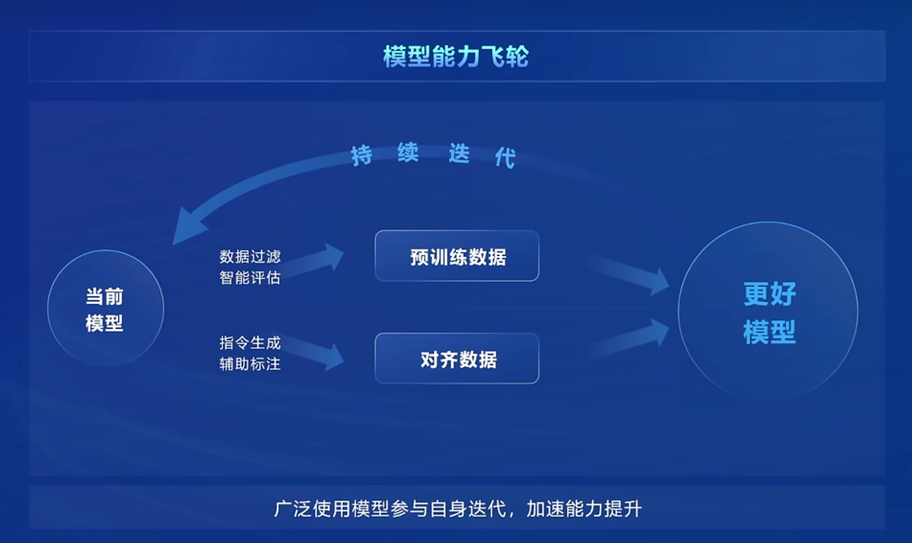
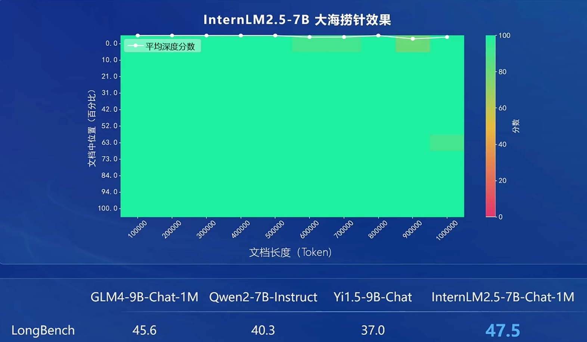
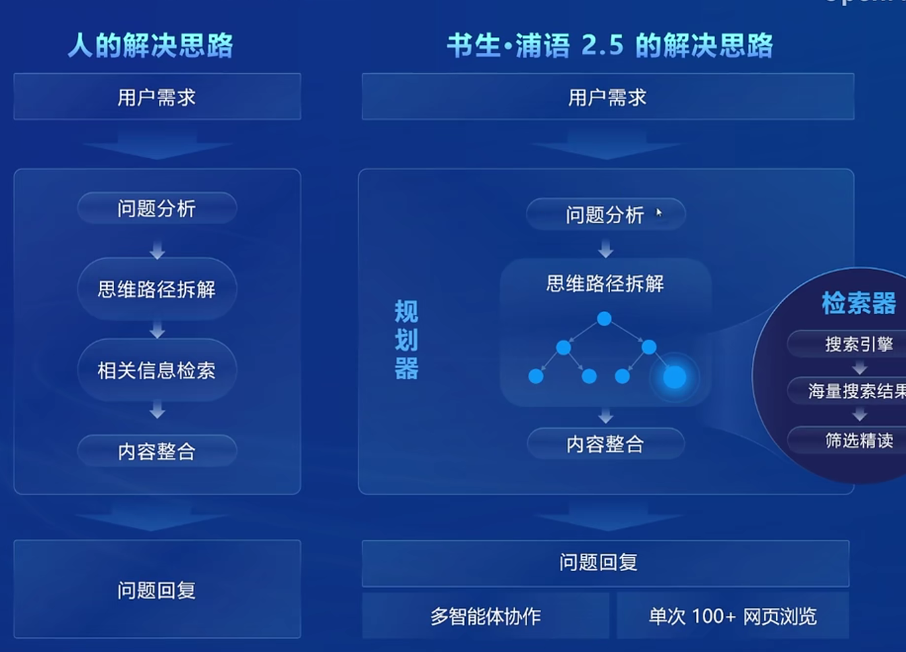
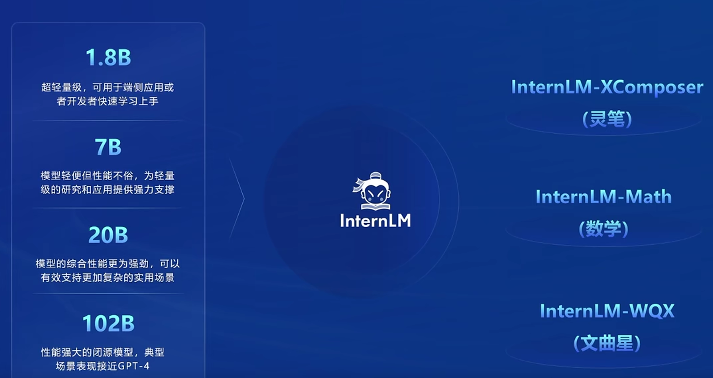
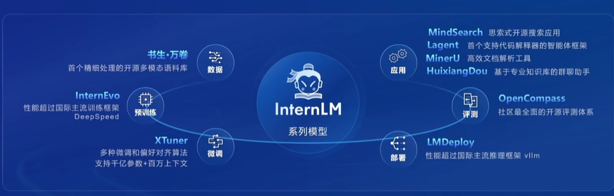
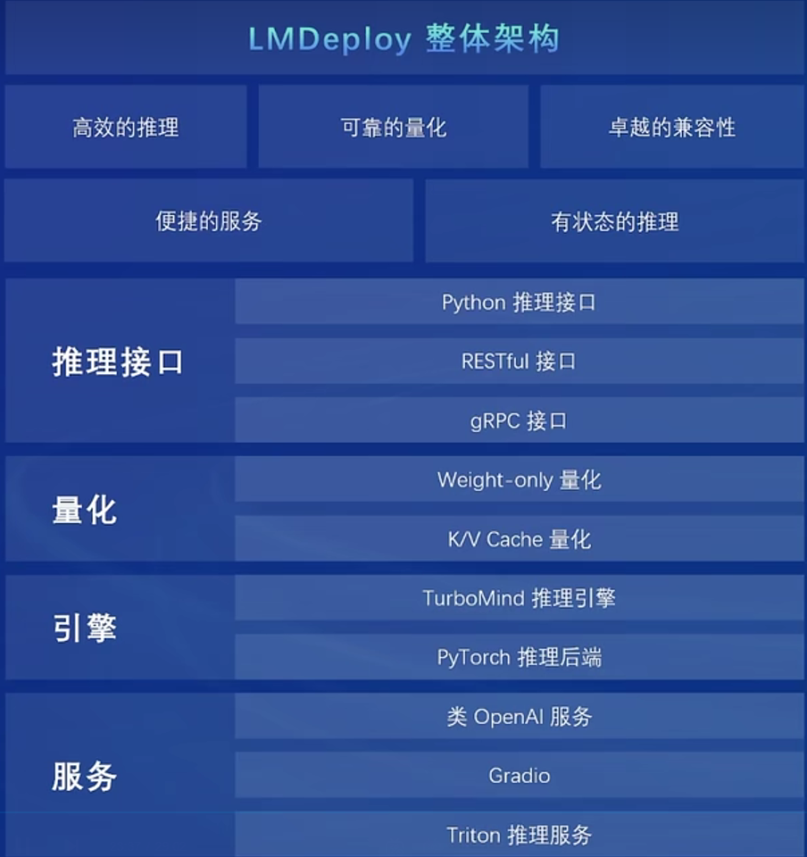

 # 0 Introduction

> 介绍了书生浦语大模型的全链路开源开放体系，包括技术发展、性能提升、模型架构、开源生态等。

**需要用到的链接：**[L1.1_书生大模型全链路开源体系视频](https://www.bilibili.com/video/BV18142187g5/?vd_source=ff3d934eb3ba9f6fad52d275a7ef2465)

**任务：**

| 完成情况 | 任务类型       | 任务内容 |
| :-: | :-: |:-:|
| ✓  | 闯关任务   | 写一篇关于书生大模型全链路开源开放体系的笔记 |

 # 1 书生·浦语开源模型概览

书生·浦语大模型从第一代InternLM已经发展到目前的InternLM2.5，开源规模从7B到20B，可以看出InternLM2.5-20B-Chat的性能与GPT4（20240409）能媲美。

## 1.1 InternLM2.5概览

当前InternLM2.5在开元模型中表现优异，比前一代模型InternLM2性能提升20%，支持100万字的上下文以及完成更复杂的任务。

**模型能力飞轮：**该模型的核心技术思路是使用当前模型不断对**数据过滤**、**智能评估**来优化预训练数据，同时用当前模型**指令生成辅助标注**来对齐数据，训练后获得更好的模型，循环往复自身迭代，加速能力提升。

**高质量合成数据：**融合多种数据合成方案，提升合成数据质量。

- 基于规则的数据构造：包括代码、公示、函数、数学题解等伪格式化、半格式化的数据。

- 基于模型的数据扩充：利用现有的商业模型对简单的代码进行注释等。
- 基于反馈的数据生成：根据模型的生成结果，人类对模型生成结果进行满意度的排序，使模型生成更能够符合人类要求的结果。 

## 1.2 InternLM2.5特点

**领先的推理能力**：在MMLU、BBH、MATH、GSM8K等基准测试上都较前一代大模型有大幅提升，领先同量级开源模型。

**100万Token上下文**：做了大海捞针实验，领先同量级大模型。大海捞针指的是模型是否完美定位在超长文本中的任何位置和信息。

**基于规划和搜索解决复杂问题**：先进行问题分析，分析成子问题之后，再分别解决子问题，最后进行内容整合。

## 1.3 书生·浦语开源模型谱系

- **从量级来分：**四个级别
- **从模态来分：**针对图像文本的灵笔、针对数学的InternLM-Math、针对高考题目的文曲星

# 2 全链条开源开放体系简介

> 从数据书生·万卷、预训练框架InternEvo、微调工具Xtuner、推理框架LMDeploy、评测体系OpenCompass到应用层面

- **数据**：语料库-书生·万卷、开源数据处理工具箱（数据提取Miner U、对话标注Label LLM、多格式数据标注Label U）

- **预训练框架InternEvo**：支持千卡以上大规模预训练、支持4D并行+Ring Attention，支持1M长文训练、兼容HF生态、支持预训练+微调+RLHF全场景覆盖。

- **微调工具Xtuner**：适配多种生态、适配多种硬件

- **推理框架LMDeploy**：

  

- **评测体系OpenCompass**：超过100+评测集、50万+题目，广泛应用于头部大模型企业和科研机构。工具（CompassKit）、基准（CompassHub）、榜单（CompassRank）三位一体。

- **应用**：智能体Lagent、MindSearch、HuixiangDou

# 3 总结

书生·浦语的开源生态体系非常完整，实战营闯关也适合激励初学者有效率地入门LLM。社区同学们的反馈和共建，也反哺全链条开源开放体系进一步完善和发展。