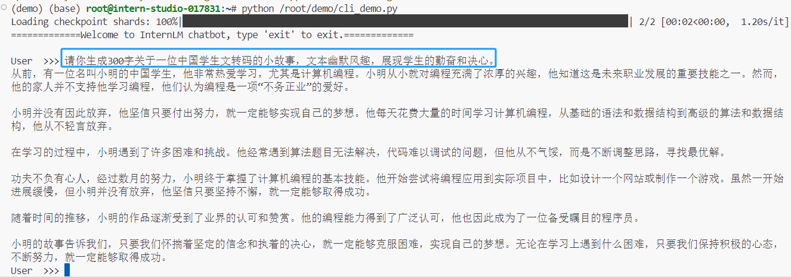
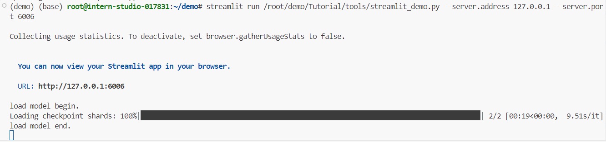
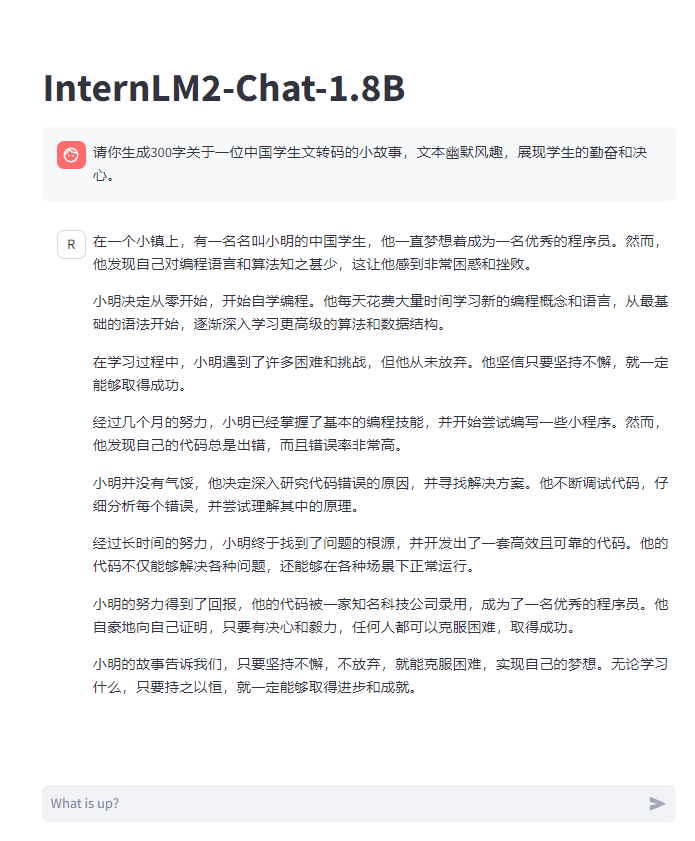
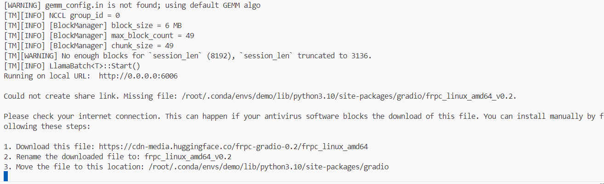
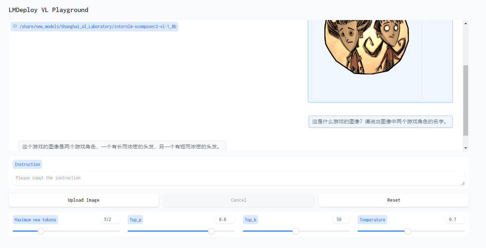
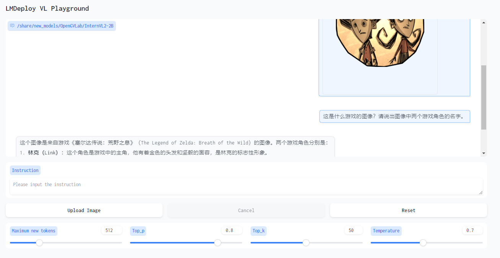

 # 0 Introduction
需要用到的几个链接：
- [InternStudio开发平台](https://studio.intern-ai.org.cn/console/dashboard)
- [L1.2_Demo文档教程](https://github.com/InternLM/Tutorial/blob/camp3/docs/L1/Demo/readme.md)
- [L1.2_Demo视频教程](https://www.bilibili.com/video/BV18x4y147SU/)

任务：
| 完成情况 | 任务类型       | 任务内容 |
| :-: | :-: |:-:|
| ✓  | 闯关任务 | 使用 Cli Demo 完成 InternLM2-Chat-1.8B 模型的部署，并生成 300 字小故事，记录复现过程并截图。 |
| ✓ | 进阶任务1 | 使用 LMDeploy 完成 InternLM-XComposer2-VL-1.8B 的部署，并完成一次图文理解对话，记录复现过程并截图。 |
| ✓ | 进阶任务2 | 使用 LMDeploy 完成 InternVL2-2B 的部署，并完成一次图文理解对话，记录复现过程并截图。 |

 # 1 闯关任务
> 使用 Cli Demo 完成 InternLM2-Chat-1.8B 模型的部署，并生成 300 字小故事，记录复现过程并截图。
## 1.1 配置环境

连接开发机之后，为本关创建一个虚拟环境，名为demo，并配置所需依赖。

```bash
# 创建环境
conda create -n demo python=3.10 -y
# 激活环境
conda activate demo
# 安装 torch
conda install pytorch==2.1.2 torchvision==0.16.2 torchaudio==2.1.2 pytorch-cuda=12.1 -c pytorch -c nvidia -y
# 安装其他依赖
pip install transformers==4.38
pip install sentencepiece==0.1.99
pip install einops==0.8.0
pip install protobuf==5.27.2
pip install accelerate==0.33.0
pip install streamlit==1.37.0
```

## 1.2 Cli Demo部署 InternLM2-Chat-1.8B 模型

> Cli Demo 通常指的是命令行界面（Command Line Interface）的示例或演示。用户通过输入文本命令来执行操作，而不是通过图形用户界面（GUI）中的鼠标点击和触摸操作。现在我们将实现在命令行界面与InternLM2-Chat-1.8B 模型进行交互。

```bash
# 创建存放代码的目录
mkdir -p /root/demo
# 创建一个部署模型的文件
touch /root/demo/cli_demo.py
# 启动模型Demo
python /root/demo/cli_demo.py
```

生成300字关于一位中国学生文转码的小故事。



## 1.3 Streamlit Web Demo 部署 InternLM2-Chat-1.8B 模型

> Streamlit 是一个开源的 Python 库，它允许开发者通过简单的 Python 脚本快速创建和分享应用程序。部署模型时，Streamlit 提供了一种快速而简洁的方法来创建交互式的 Web 应用程序。

```bash
cd /root/demo
# clone 仓库，以获取 Streamlit Web Demo的代码
git clone https://github.com/InternLM/Tutorial.git
# 启动 Streamlit 服务
streamlit run /root/demo/Tutorial/tools/streamlit_demo.py --server.address 127.0.0.1 --server.port 6006
```

- 如果用的VSCode 远程连接的开发机，执行以上命令后会直接跳出6006端口可用，选择浏览器中打开即可。

- 如果用的其他开发工具远程链接，在本地的PowerShell 中输入以下命令，将端口映射到本地。

```bash
# XXXX 替换为你的 ssh 端口号
ssh -CNg -L 6006:127.0.0.1:6006 root@ssh.intern-ai.org.cn -p XXXX
```



在浏览器访问 http://localhost:6006 或者 127.0.0.1:6006 启动Demo




# 2 进阶任务

> - 使用 LMDeploy 完成 InternLM-XComposer2-VL-1.8B 的部署，并完成一次图文理解对话，记录复现过程并截图。
>
> -  使用 LMDeploy 完成 InternVL2-2B 的部署，并完成一次图文理解对话，记录复现过程并截图。

## 2.1 LMDeploy 部署 InternLM-XComposer2-VL-1.8B 模型

> InternLM-XComposer2 是一款基于 InternLM2 的视觉语言大模型，其擅长自由形式的文本图像合成和理解。
>
> LMDeploy 是一个用于压缩、部署和服务 LLM 的工具包，由 MMRazor 和 MMDeploy 团队开发。

### 2.1.1 环境配置

激活上一节创建的虚拟环境Demo，安装LMDeploy以及其他依赖

```bash
conda activate demo
pip install lmdeploy[all]==0.5.1
pip install timm==1.0.7
```

### 2.1.2 LMDeploy 启动 Gradio 服务

使用 LMDeploy 启动一个与 InternLM-XComposer2-VL-1.8B 模型交互的 Gradio 服务。

```bash
lmdeploy serve gradio /share/new_models/Shanghai_AI_Laboratory/internlm-xcomposer2-vl-1_8b --cache-max-entry-count 0.1
```



用浏览器打开 http://0.0.0.0:6006 



模型对于特定游戏图像的解答比较棘手，可能是对这方面的训练数据不够。

## 2.2 LMDeploy 部署 InternVL2-2B 模型

> InternVL2 是上海人工智能实验室推出的新一代视觉-语言多模态大模型，是首个综合性能媲美国际闭源商业模型的开源多模态大模型。InternVL2 系列从千亿大模型到端侧小模型全覆盖，通专融合，支持多种模态。

### 2.2.1 环境配置

与上一节的虚拟环境Demo一致，不用下载别的依赖。

### 2.2.2 LMDeploy 启动 Gradio 服务

```bash
lmdeploy serve gradio /share/new_models/OpenGVLab/InternVL2-2B --cache-max-entry-count 0.1
```

用浏览器打开 http://0.0.0.0:6006 



相较于 InternLM-XComposer2-VL-1.8B 模型，InternVL2-2B 模型虽然回答错误，但能够遵循指令，回答出游戏类和人物名字。

## 2.3 InternLM-XComposer2-VL-1.8B 模型 VS InternVL2-2B 模型

想要区别这两个模型，但是未能找到 InternVL2-2B 模型的仓库和详细介绍。后续找到相关资料会补全细节。